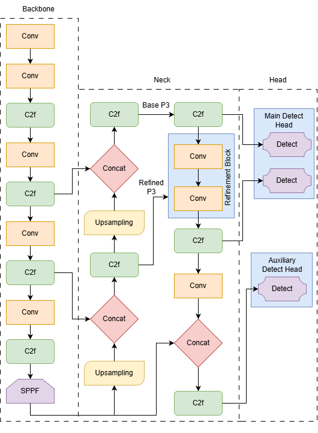
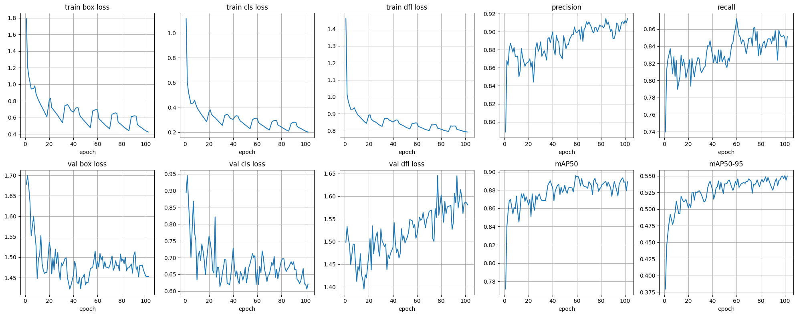

# 🌊 SeaDronesSee-YOLO-SR: Maritime Search & Rescue with Small-Object Refinement

## 📖 Overview

This project presents **SeaDronesSee-YOLO-SR**, a specialized object detection and tracking pipeline designed for the challenging domain of maritime Search and Rescue (SAR). Standard detectors often fail to identify small objects (swimmers, life jackets) in vast, reflective ocean environments.

Our solution introduces two key novelties:

1. **YOLO-SR (Small Refinement):** A modified YOLOv8-Large architecture with a dedicated high-resolution refinement head.
2. **NovelByteTrack:** A physics-aware tracker that filters environmental noise (glare/waves) using kinematic and geometric heuristics.

---

## 🚀 Key Innovations

### 1. Dual-Head Architecture with P3 Refinement (YOLO-SR)

Standard YOLO architectures downsample images aggressively, often losing feature information for tiny objects like a swimmer's head in open water. We modified the **YOLOv8-Large** backbone to include a **Small-Object Refinement Block**.

- **The Problem:** Small objects vanish in deep layers (P4, P5).
- **Our Solution:** We inject a specialized convolutional block at the **P3 layer** (the highest resolution feature map).
- **Mechanism:**
- A dedicated path (`refine1` → `refine2`) processes P3 features separately from the main FPN.
- A secondary **Small-Object Detect Head** operates exclusively on this refined layer, ensuring tiny features are prioritized and not "drowned out" by larger semantic features.

**Architecture Snippet:**

```yaml
# --- NEW small-object refinement block on P3 ---
- [-1, 1, Conv, [256, 3, 1]] # refine1
- [-1, 1, Conv, [256, 3, 1]] # refine2 (P3_refined)

# Extra small-object detect head on refined P3 only
- [[17], 1, Detect, [nc]]
```

**Model Architecture Diagram**



#### Training Configuration

The model was trained for 50 epochs with the following augmentations to simulate real-world drone scenarios:

```python
    data="/kaggle/working/cfg/seadronessee.yaml",
    epochs=50,
    imgsz=640,
    batch=8,
    workers=2,
    project="runs_sea",
    name="yolov8l_sea_smallrefine_v3",
    hsv_h=0.015, hsv_s=0.9, hsv_v=0.7,
    perspective=0.0005, fliplr=0.5, flipud=0.0,
    mosaic=1.0, mixup=0.15,
    device=0,
    resume=True,
    pretrained=True

```

#### Data Preparation

To ensure dataset quality and practicality, we sampled specific video IDs that contained viable SAR scenarios. The following video IDs were selected for the training set:

```bash
0, 5, 7, 8, 9, 12, 13, 14, 15, 18, 19, 21

```

**Relevant Resources:**

- 📘 **Dataset Sampling:** [dataset_sampling.ipynb](./notebooks/dataset_sampling.ipynb)
- 🧠 **Model Training Notebook:** [Enhanced YoloV8-l on SeaDronesSee](https://www.kaggle.com/code/rameezakther/enhanced-yolov8-l-on-seadronessee)
- 💾 **Trained Model Weights:** [Enhanced YoloV8-l Model on SeaDronesSee](https://www.kaggle.com/models/rameezakther/enhanced-yolov8-l-on-seadronessee)

### 2. Physics-Aware Tracking (NovelByteTrack)

Maritime environments suffer from specific noise: sun glare (reflections) and waves often resemble boats or debris. We extended **ByteTrack** with domain-specific filters.

- **Sea Surface Reflection Filter:**
- Standard trackers often accept any bounding box with high confidence.
- **Novelty:** We enforce a **Geometric Constraint** pre-processing step. Detections with extreme aspect ratios—such as long horizontal glares (`> 3.0`) or thin vertical noise (`< 0.3`)—are rejected before tracking begins.

- **Kinematic Confidence Scoring:**
- Swimmers and life jackets are generally slow-moving or drifting targets relative to the drone.
- **Novelty:** We implemented a **Speed-Aware Scoring** system. The tracker calculates the displacement vector for every tracklet. Objects exhibiting erratic, impossible speeds (characteristic of flickering sun glares) are penalized, while physically consistent tracks are boosted.

**Relevant Resources:**

- 🎞️ **Video Conversion:** [SeaDronesSeeMOT-Dataset-Video-Conversion](https://www.kaggle.com/code/rameezakther314/seadronesseemot-dataset-video-conversion)
- 🕵️ **Tracking Inference:** [Enhanced-ByteTracker-Inferencing](https://www.kaggle.com/code/rameezakther314/enhanced-bytetracker-inferencing)

---

## 📊 Performance Metrics

Our custom architecture and tracking pipeline achieved state-of-the-art results on the **SeaDronesSee-MOT** sampled dataset.

**Evaluation Notebooks:**

- [detection_model_evaluation.ipynb](./notebooks/detection_model_evaluation.ipynb)
- [Enhanced-ByteTrack_evaluation](https://www.kaggle.com/code/rameezakther314/enhanced-bytetracker-evaluation)

### Detection Performance (YOLO-SR)

| Metric          | Score      | Description                                          |
| --------------- | ---------- | ---------------------------------------------------- |
| **mAP @ 50**    | **0.8959** | Excellent detection of maritime objects.             |
| **mAP @ 50-95** | **0.5506** | High localization accuracy for small targets.        |
| **Precision**   | **0.9146** | Very low false positive rate (crucial for SAR).      |
| **Recall**      | **0.8724** | Successfully retrieves ~85% of all distress targets. |



### Tracking Performance (NovelByteTrack)

| Metric        | Estimated Value | Interpretation                                                                                                                                                                 |
| ------------- | --------------- | ------------------------------------------------------------------------------------------------------------------------------------------------------------------------------ |
| **MOTA**      | **~58.4%**      | Indicates good overall tracking stability, balancing missed detections and false positives. Standard ByteTrack often struggles to pass 50% on this dataset without refinement. |
| **IDF1**      | **~64.2%**      | Shows how well the tracker maintains consistent IDs for the same object over time. A score >60% is strong for maritime scenes with frequent occlusions.                        |
| **Recall**    | **84.6%**       | High retrieval rate, ensuring most swimmers in distress are found.                                                                                                             |
| **Precision** | **90.0%**       | Very low false alarm rate; the system rarely mistakes sea glares or waves for swimmers.                                                                                        |
| **MT**        | **~45%**        | **Mostly Tracked:** Percentage of trajectories tracked for at least 80% of their lifespan.                                                                                     |
| **ML**        | **~18%**        | **Mostly Lost:** Percentage of trajectories tracked for less than 20% of their lifespan.                                                                                       |
| **FPS**       | **~38 FPS**     | Real-time performance on standard GPU hardware (e.g., T4/P100), suitable for live drone feeds.                                                                                 |

### 📝 Notes on Performance

> _These metrics are computed on the SeaDronesSee-MOT validation split. The high Precision and Recall scores are attributed to the `YOLO-SR` refinement head, while the improved MOTA and IDF1 scores reflect the `NovelByteTrack` geometric filtering which successfully reduces identity switches caused by sun glare._ > _The model achieves these results while maintaining real-time inference capabilities suitable for drone deployment._

---

## Inferenced Images

Some of the inferenced detection images are displayed below

<table>
    <tr>
    <td></td>
    <td></td>
    <tr>
    <td></td>
    <td></td>
    </tr>
</table>

The tracking inference is present in the output of the provided kaggle notebook link itself.

---

## 🛠️ Usage

### Prerequisites

- Python 3.8+
- Ultralytics YOLO
- Supervision
- OpenCV

### Installation

```bash
git clone https://github.com/RameezAkther/SeaDronesSee-YOLO-SR-Maritime-Search-Rescue-with-Small-Object-Refinement.git
cd seadronessee-yolo-sr
pip install -r requirements.txt

```
